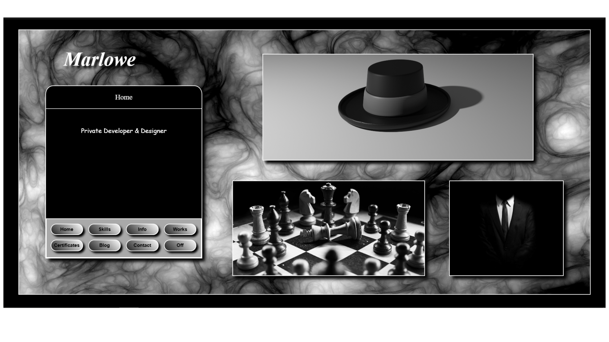
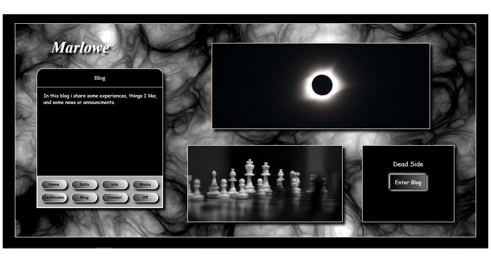
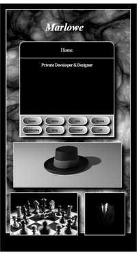
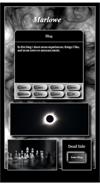
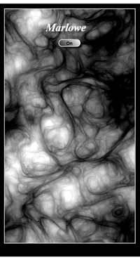

# Marlowe - Final Portfolio Version

## 📋 Project Overview

**Marlowe** represents the final, polished iteration of the personal portfolio series that began with version 3.0. This culmination of the design journey brings together the strongest elements of previous versions into a refined, professional presentation that served as the primary portfolio for showcasing development and design capabilities.

**Live Demo:** [https://alaa-younsi.github.io/Marlowe/](https://alaa-younsi.github.io/Marlowe/)

---

## 🎯 Project Purpose

This portfolio served as:
- **Primary professional showcase** - The main online presence for client engagement and opportunity outreach
- **Evolutionary culmination** - The final form of a multi-version design journey from basic HTML/CSS to sophisticated presentation
- **Skill demonstration platform** - A living example of front-end development, UI/UX design, and personal branding capabilities
- **Client conversion tool** - A structured interface for turning visitors into project inquiries

---

## 🛠️ Technology Stack

### Core Implementation
- **HTML5** - Semantic, accessible markup structure
- **CSS3 with Sass** - Advanced styling with preprocessing for maintainability
- **JavaScript & jQuery** - Interactive functionality and smooth user experience
- **Responsive Design** - Fully adaptive layout for all devices

### Featured Skill Showcase
The portfolio demonstrates proficiency across:
- **Frontend**: React, Vue, AngularJS, Redux, Bootstrap, SVG/Canvas
- **Backend**: Node.js, PHP, MongoDB, SQL/MySQL, Raspberry Pi
- **Design**: Adobe Creative Suite, Blender, UI/UX principles
- **Tools**: Git, Webpack (implied by project structure)

---

## 📁 Project Structure & Design

### Information Architecture
1. **Hero Section** - Compelling introduction with mission statement
2. **Services Overview** - High-level service categories (Frontend, Backend, Design)
3. **Personal Information** - Background, education, personal details
4. **Certificates Showcase** - Visual proof of technical certifications
5. **Detailed Skills Blog** - Comprehensive technology breakdown
6. **Contact Protocol** - Structured client engagement guidelines
7. **Personal Narrative** - "Nyctophilia" blog post adding character depth

### Design Philosophy
- **Minimalist aesthetic** with strategic visual hierarchy
- **Card-based layout** for scannable content presentation
- **Consistent typography** and spacing throughout
- **Atmospheric elements** that support the "Marlowe" detective persona
- **Professional clarity** balanced with personal expression

---

## ✨ Key Features

### Professional Presentation
- **Visual certificate display** - Credibility through demonstrated achievements
- **Structured service offerings** - Clear client pathways for different needs
- **Detailed skill inventory** - Comprehensive technology proficiency listing
- **Brand consistency** - Unified "Marlowe" identity across all elements

### User Experience
- **Intuitive navigation** - Clear information architecture
- **Responsive performance** - Optimized experience across devices
- **Progressive disclosure** - Layered information presentation
- **Accessible design** - Considerations for diverse users

### Client Conversion Elements
- **Specific contact protocol** - Clear instructions for project inquiries
- **Professional email domain** - `marlowe@detective-marlowe.me`
- **Multiple service categories** - Addressing diverse client needs
- **Deadline and payment clarity** - Setting professional expectations

---

## 🔄 Evolution from Previous Versions

This final version represents the synthesis of learnings from:
- **v3.0** - Basic structure and personal introduction
- **v4.0** - Service orientation and professional framing
- **v5.0** - Brand refinement and contact professionalization
- **v6.0** - Modern layout and visual certificate integration

Key improvements in this final iteration include:
- **Polish and refinement** of all visual elements
- **Performance optimization** for faster loading
- **Content finalization** with corrected text and improved flow
- **Interaction enhancements** for smoother user experience
- **Mobile experience** refinements

---

## 🚀 Professional Impact

### As a Development Showcase
The portfolio demonstrates:
- **Full-stack awareness** - From frontend UI to backend infrastructure
- **Design integration** - Combining development with visual design principles
- **Project evolution** - Showcasing the journey from concept to polished product
- **Technical diversity** - Broad proficiency across multiple technology stacks

### As a Business Tool
- **Lead generation structure** - Clear pathways from visitor to client
- **Service packaging** - Professional framing of development offerings
- **Trust building** - Certificates and detailed skills establishing credibility
- **Personal differentiation** - Unique "Marlowe" brand distinguishing from competitors

---

## 📈 Skills Demonstrated

### Technical Implementation
- **Modern CSS techniques** - Flexbox/Grid, animations, responsive design
- **JavaScript proficiency** - Interactive features and smooth animations
- **Build process understanding** - Organized project structure and asset management
- **Performance optimization** - Fast loading and efficient code

### Professional Competencies
- **Personal branding** - Consistent "Marlowe" identity development
- **Client communication** - Structured inquiry process and expectation setting
- **Content strategy** - Balanced professional and personal elements
- **Design thinking** - User-centered approach to portfolio creation

---

## 📄 License

This project is licensed under the MIT License - see the [LICENSE](LICENSE) file for details.

## 👤 Author & Legacy

**Alaa Younsi / "Marlowe"**  
*Full-Stack Developer & Designer*

This portfolio represents the culmination of a self-taught journey from HTML/CSS basics to sophisticated full-stack development capabilities. It served as the primary professional interface for multiple years, generating client interest and opportunity while evolving alongside developing skills.

---

## 🔮 Historical Significance

While eventually succeeded by more advanced portfolios, this "Marlowe" version represents:
- **A major milestone** in technical and design capability
- **Transition completion** from learner to practitioner
- **Personal brand establishment** that would influence future work
- **Foundation building** for more complex projects and client work

---

*This portfolio stands as testament to the power of iterative improvement - showing how consistent refinement transforms basic concepts into professional tools that open doors and create opportunities.*
